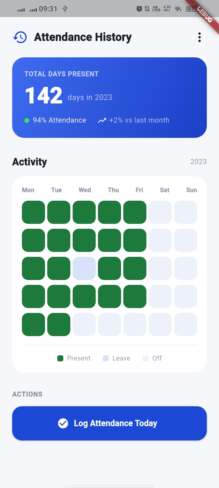

# attendanceapp_flutter

A Flutter app that displays an attendance history dashboard for a single user.

## Current UI

The app opens directly on one screen, `AttendanceHistoryScreen`:

- **Top bar** — "Attendance History" title with a history icon and an overflow (more) icon.
- **Summary card** — blue gradient card showing total days present (142 in 2023), attendance percentage (94%), and month-over-month change (+2%).
- **Activity section** — header labeled "Activity" for the year 2023, followed by a weekly grid (Mon–Sun) of colored squares marking each day as Present, Leave, or Off, with a legend below the grid.
- **Actions** — an "ACTIONS" label and a full-width "Log Attendance Today" button.

All data shown (attendance counts, weekly grid, percentages) is static/sample data defined in code — there is no backend or persistence layer yet.

## Screenshot

<p align="center">
  
</p>

## Project structure

```
lib/
  main.dart                          # App entry point, MaterialApp setup, theme
  screens/
    attendance_history_screen.dart   # Attendance History screen and its widgets
test/
  widget_test.dart                   # Basic smoke test (verifies the screen renders)
```

## Getting started

```bash
flutter pub get
flutter run
```

Run tests with:

```bash
flutter test
```

## Requirements

- Flutter SDK (Dart ^3.12.0)
